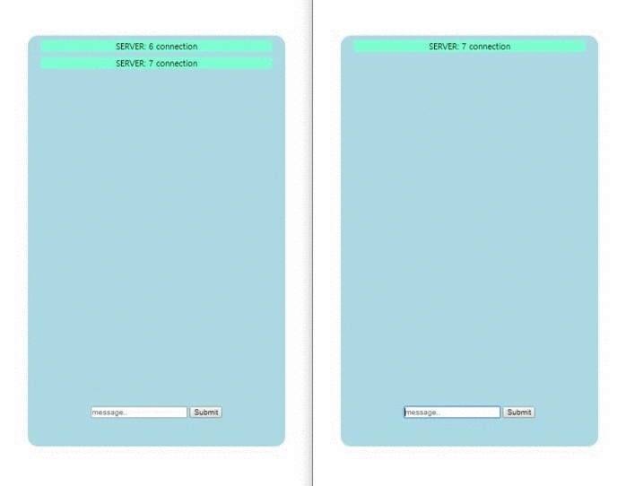

# Real_Time_Chat

> **Reference**: <https://codevkr.tistory.com/62?category=719250>
>
> 위의 블로그 내용을 참고하였습니다.

### setting

1. install node modules

```shell
npm install
```

2. run server

```shell
node app.js
```


### socket.io

*Node.js* + *html, css, js*





